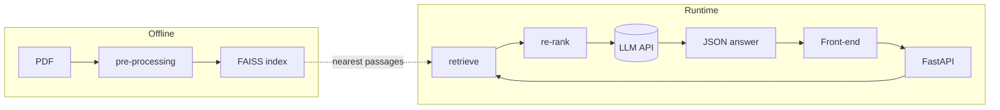

# Gatsby QA System

    

> **Ask anything about *The Great Gatsby* and get crisp, cited answers in seconds.**

A light‑weight Retrieval‑Augmented Generation (RAG) demo that converts the novel PDF into an interactive flash‑card experience—all on commodity hardware.

---

## ✨ Features

* **5-8 s latency** on a single CPU core
* Minimal **Python + FastAPI** back‑end, **vanilla JS** front‑end (no heavy frameworks)
* Offline PDF ingestion → FAISS index… only once
* OpenAI chat completion for final wording
* Responsive flash‑card UI with animated skeleton loaders
* One‑command local launch or drop‑in Dockerfile

---

## 🏗️ System Design



---

## 🚀 Quick‑start

```bash
# 1️⃣ Clone & install
$ git clone && cd independent
$ pip install -r requirements.txt

# 2️⃣ Set your OpenAI API key
$ export OPENAI_API_KEY="sk‑..."

# 3️⃣ Build the index (first run only)
$ python3 backend/in_p.py

# 4️⃣ Launch
$ cd independent/backend
$ uvicorn backend.main:app --port 8000 --reload
$ open http://localhost:8000 to see
```

---

## 🗂️ Project layout

```
├─ backend/
│  ├─ in_p.py             # offline index builder
│  ├─ answer_rag.py       # helper functions
│  └─ main.py             # FastAPI app (POST /ask)
├─ frontend/
│  ├─ index.html
│  └─ style.css
├─ data/                  # PDF, FAISS index, pickled chunks
├─ requirements.txt
└─ README.md
```

---

## 🔧 Configuration

| Variable | Default | Description |
|----------|---------|-------------|
| `OPENAI_API_KEY` | — | Your OpenAI secret key |
| `TOP_K` | `3` | Number of passages returned by FAISS |
| `MODEL_NAME` | `gpt-4o-mini` | Chat model for answer generation (can be changed)|

Adjust constants in `backend/answer_rag.py` to tune passage size, overlap, or temperature.

---

## 🧪 Testing

send a manual curl:

```bash
curl -X POST localhost:8000/ask -H "Content-Type: application/json" \
     -d '{"question":"What are the major themes of the novel?"}'
```

---

## 🗺️ Roadmap

- [ ] Stream tokens to front‑end for instant feedback
- [ ] Multi‑document support
- [ ] Dark‑mode toggle
- [ ] Dynamic style variants

---

## 📜 License

MIT © 2025 Muyuan He

---

## 🙏 Acknowledgments

* [pdfminer.six](https://github.com/pdfminer/pdfminer.six) for reliable PDF text extraction
* [Sentence‑Transformers](https://www.sbert.net/) and [FAISS](https://github.com/facebookresearch/faiss) for fast semantic search
* [OpenAI](https://platform.openai.com/) for the chat completion API
